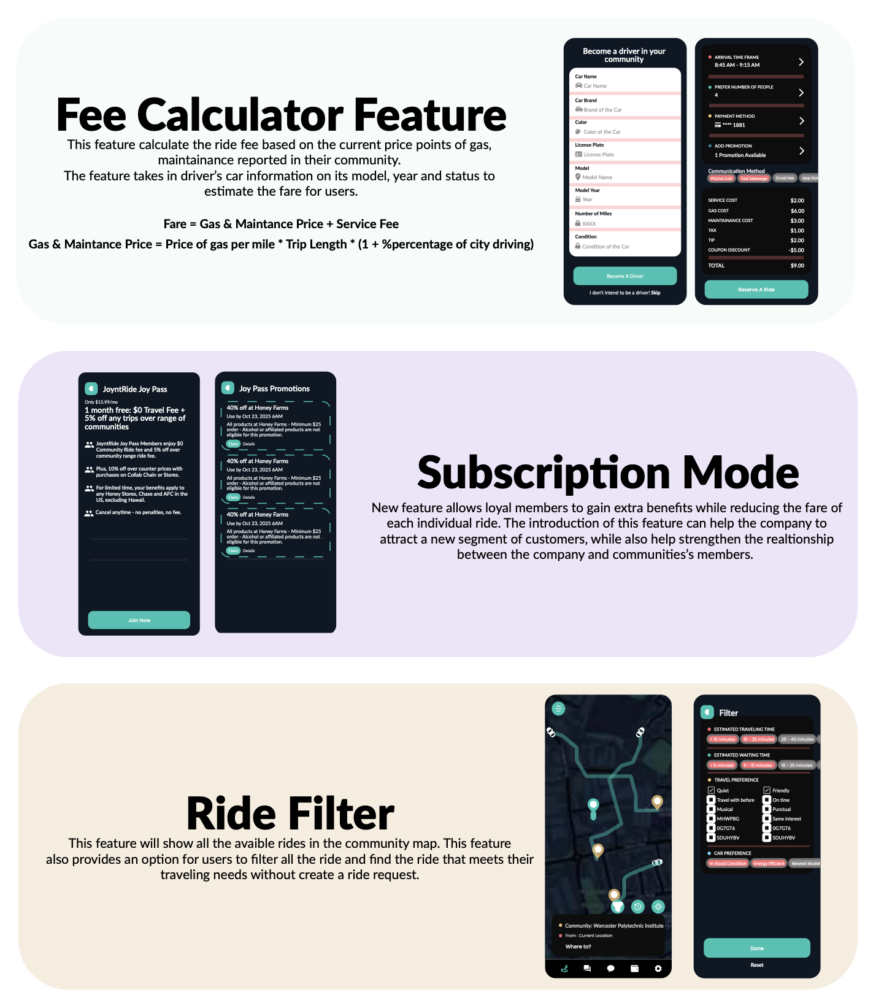
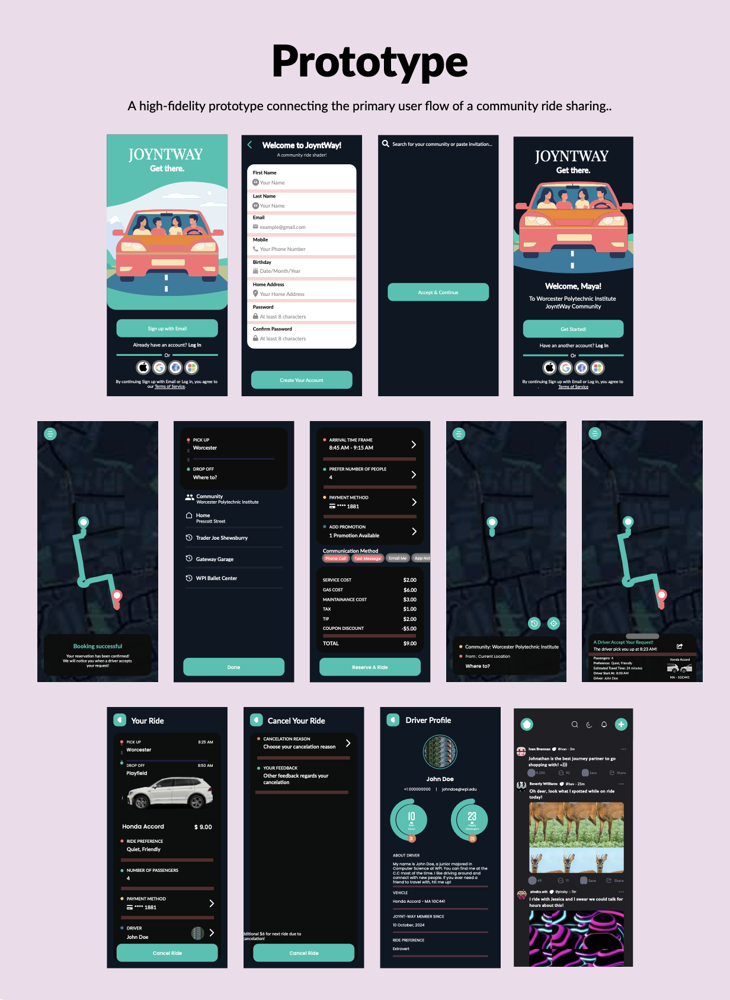

# 🚗 Joyntway – Ride Sharing Product Development  

This project focuses on **end-to-end product development** for a ride-sharing platform, covering **market research, go-to-market strategy, product design, and prototyping**.  

We developed a sustainability-driven business model and created a prototype to simulate user experience, supported by detailed market analysis and strategic launch planning.  

---

## 📌 Project Overview  
- Conducted **market research & competitor analysis**  
- Designed the **Joyntway product prototype**  
- Developed **features and functionality roadmap**  
- Built a **go-to-market strategy** for product launch  
- Created a **ride-sharing prototype (PDF + mockups)**  
- Delivered a **final report with insights & recommendations**  

---

## 📊 Dashboard & Prototype Previews  

### Key Features  

### Prototype Screens  
  

---

## 📂 Project Files  
- 📄 [Final Report – Joyntway](./Final%20Report%20Joyntway.docx)  
- 📑 [Prototype Design (PDF)](./Joyntway-Ride%20sharing%20Prototype%20.pdf)  
- 🖼️ [Features Overview (PNG)](./Features_Joyntway.png)  
- 🖼️ [Prototype Mockup (PNG)](./Prototype_joyntway.png)  

---

## 🚀 Go-to-Market Strategy  
- Defined **target customer segments**  
- Developed **pricing and adoption strategies**  
- Planned **launch marketing campaigns**  
- Evaluated **risks & mitigation strategies**  

---

## 👥 Team Contribution  
This was a collaborative project focused on **innovation, design thinking, and market-driven product development**.  

---

## 🔗 Related Links  
- Prototype (PDF) included above  
- Full project report included in repo  

---

✨ *This repository demonstrates product development skills across research, design, and strategy, making it a strong portfolio example.*  

